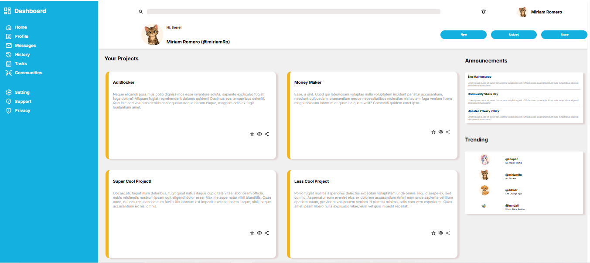

# Admin Dashboard

A responsive admin dashboard built with HTML and CSS Grid, featuring a sidebar navigation, top navbar, project cards, announcements, and a trending section.

## Preview

[Admin Dashboard](https://miriamromeromon.github.io/admin-dashboard/)

## Features

- **Sidebar** — Fixed navigation with icon links grouped into main nav and settings
- **Navbar** — Search bar, notification bell, and user profile display
- **Greeting bar** — User welcome message with quick action buttons (New, Upload, Share)
- **Projects grid** — 2-column card layout with yellow accent borders
- **Announcements** — Sidebar panel with bordered section separators
- **Trending** — User list with avatar, username, and project name

## Tech Stack

- HTML5
- CSS3 (Grid & Flexbox)
- Google Fonts — [Inter](https://fonts.google.com/specimen/Inter)

## Layout

The layout is built entirely with CSS Grid:

- The `body` uses a 2-column grid (sidebar + main area) with 2 rows (navbar + content)
- The sidebar spans both rows on the left
- The navbar sits at the top right
- The content area uses a nested grid for projects, announcements, and trending